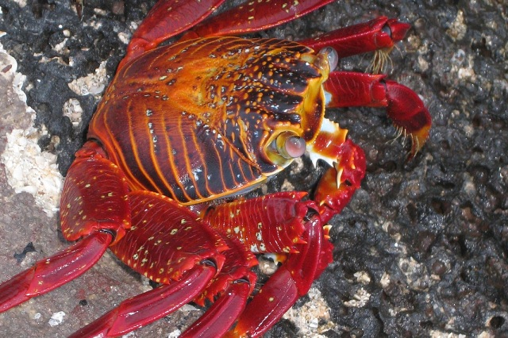

--- 
title: "Analyse des données multi-dimensionnelles"
author: Vivien Roussez & Pascal Irz
date: '`r format (Sys.time(), "%d %B %Y")`'
site: bookdown::bookdown_site
output: bookdown::gitbook
documentclass: book
biblio-style: apalike
link-citations: yes
github-repo: rstudio/bookdown-demo
description: "Parcours de formation R (module 4)"
---

<!-- bibliography: [book.bib, packages.bib] -->


```{r setup, include=FALSE}
rm (list = ls ())
knitr::opts_chunk$set (echo = T, message = F, error = F,warning = F, fig.width = 6, fig.height = 6)
require (tidyverse)
require (FactoMineR)
require (factoextra)
require (GGally)
require (ggExtra)
require (data.table)
require (DT)
```

<style> body {text-align: justify}  </style>

# Introduction



<font size="2"> 
*Crédit photographique Pascal Irz*
</font> 


## Le parcours de formation {.unnumbered}

```{r collecte prez parcours, results='asis', warning=FALSE, echo=FALSE}
# Utilisation du chapitre de présentation du parcours présent dans https://github.com/MTES-MCT/parcours-r
cat(stringi::stri_read_lines("https://raw.githubusercontent.com/MTES-MCT/parcours-r/master/parties_communes/le_parcours_R.Rmd", encoding = "UTF-8"), sep = "\n")
```


## Le groupe de référents R du pôle ministériel {.unnumbered}

```{r collecte prez ref, warning=FALSE, echo=FALSE, message=FALSE, results='asis'}
# Utilisation du chapitre de présentation des référents présent dans https://github.com/MTES-MCT/parcours-r
a <- knitr::knit_child(text = stringi::stri_read_lines("https://raw.githubusercontent.com/MTES-MCT/parcours-r/master/parties_communes/les_referents_R.Rmd", encoding = "UTF-8"), quiet = TRUE)
cat(a, sep = '\n')
```


## Objectifs du module 4 {.unnumbered}

- Connaissance (de  certains) des outils R d'analyse des données multivariées.
- Quelques rappels sur l'interprétation des résultats.
- Mise en oeuvre et interprétation des méthodes usuelles.

Ce module balaye les techniques statistiques qui permettent d'explorer efficacement un jeu de données contenant un nombre important de variables. Ces méthodes produisent des graphiques et des statistiques qui mettent en évidence les liens et corrélations entre $p$ variables simultanément, ainsi que les proximités entre les $n$ observations.


```{r, echo = FALSE, fig.width = 10, fig.height = 6}
par (mfrow = c (1,2))
acp <- PCA (iris, quali.sup = 5, graph = F)
plot.PCA (acp, choix = "ind", col.ind = "lightblue", col.quali = "red")
HCPC (acp, nb.clust = 3, graph = F) %>%
  plot.HCPC (choice = "3D.map")
```


Il fait une petite entorse à la philosophie générale du parcours, dans la mesure où le principal *package* mobilisé ne fait pas partie du *tidyverse*, et que les sorties graphiques sont des graphiques R de base. Mais ceux-ci ont une vocation essentiellement exploratoire (on publie rarement les graphiques qui seront vus dans ce module) ; il est naturellement toujours possible de basculer dans le *tidyverse* modulo quelques opérations.

Les méthodes abordées sont les suivantes :

- Analyse en composantes principales (ACP)
- Analyse factorielle des correspondances (AFC)
- Analyse des correspondances multiples (ACM)
- Classification ascendante hiérarchique (CAH)
- K-means

Elles permettent d'explorer un jeu de données complexe en l'abordant comme un tout, au lieu d'en étudier les variables une par une, voire en les croisant par paires. Ces méthodes sont utlisées dans de nombreux champs :

- Ecologie
- Sociologie
- Chimie
- Biologie
- Economie
- Géographie
- Psychologie
- etc.

La lecture des résultats est facilitée par des représentations graphiques à la lecture relativement intuitive.


